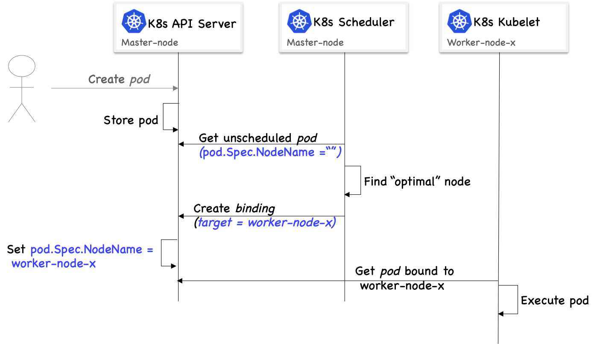

# Scheduling Extensions in Kubernetes

TL;DR: this article shows a simple [example in golang](./cmd/main.go) on how to write a kubernetes scheduler [extension](#Extending-the-Default-Scheduler), and how to [configure the default scheduler](./config-files/default-scheduler-with-config.yaml) to use the extension.

## Introduction:

In computing, we refer to scheduling as the method by which tasks are assigned to resources that complete the tasks. For the Kubernetes scheduler, these tasks are pods that need to be assigned to nodes.

A `pod` is a grouping of one or more containers including processes and threads that will consume compute resources such as CPU, Memory, Storage, etc. From that perspective, a `pod` has resource requirements.
The node in a Kubernetes cluster is a machine (physical or virtual) hosting the Kubernetes Kubelet (the agent responsible for managing the lifecycle of the containers in the cluster). As such, the node has resource capabilities that reflect its capacity (e.g., number of CPUs and memory size).

The scheduler is a core component of the Kubernetes cluster. However, and contrary to the common belief, it is not a mandatory one. To illustrate this point, let’s take a (simplified) look at the sequence of events that takes place when a `pod` of created, as illustrated in the figure below:


 

When a user creates a `pod` in Kubernetes, e.g., using the Kubectl CLI, the `pod` description is stored through the Kubernetes API-server (persisted with Etcd). The scheduler is constantly listening for pods that have not yet been assigned to nodes. I.e., the value of the `nodeName` attribute in their `Spec` section is not set. When such a `pod` is encountered, the scheduler will go through the list of available node in the Kubernetes cluster, and select the optimal node for the `pod` (we will illustrate the selection process in the next section). The scheduler cannot modify the Specs of the `pod`; instead it creates a Binding resource that refers to the `pod` and has in the target field the selected node name as value. The API-server then performs a few checks (such as making sure the `pod` is not in a [terminating state](https://github.com/kubernetes/kubernetes/blob/a18c902085aa416c8f6786a748b040d513729920/pkg/registry/core/pod/storage/storage.go#L176), or [already assigned](https://github.com/kubernetes/kubernetes/blob/a18c902085aa416c8f6786a748b040d513729920/pkg/registry/core/pod/storage/storage.go#L179)), and then modifies the `pod` `Spec` and sets the `nodeName` attribute accordingly, and changes the `pod` status conditions to [PodScheduled](https://github.com/kubernetes/kubernetes/blob/a18c902085aa416c8f6786a748b040d513729920/pkg/registry/core/pod/storage/storage.go#L190). Only then, the Kubelet of the node with the target name gets the `pod` description and starts creating containers using container runtime. And thereafter updates the `pod` status to Running (assuming no errors occur).

## Avoiding the Scheduler:

As shown in the figure above, the scheduler is not on the critical path for creating `pod` and having its containers executed. In other terms, as long as we find a way to set the `nodeName` attribute, we can ensure the Kubelet will handle the lifecycle of our pod’s containers. Even if the scheduler is missing.

### Statically Specify the `nodeName`:

We can circumvent the use of the scheduler all-together by creating a `pod` with the `nodeName` already specified.

```yaml
Kubectl create -f- <<EOF
apiVersion: v1
kind: Pod
metadata:
  name: assigned-pod
spec:
  nodeName: worker-node2 #statically assigned node
  containers:
  - name: nginx
    image: nginx
EOF
```

In the above `pod` description, we are specifying `nodeName` to a specific node in our cluster; hence there is no need for the scheduler. The desired node will pick up the `pod` description and create the `pod` with an nginx container.

Obviously statically assigning a `pod` to a node is not an optimal solution. If such a node fails or becomes unavailable, the `pod` will be left without scheduling. Moreover, we are not verifying the available capacity on the node before assigning the `pod` to it.

### Manually creating `Binding`:

An alternative solution to statically assigning nodes to pods is to manually create the binding resource, after creating the `pod`. An example `Binding` is shown below. In this `Binding` we are instructing Kubernetes to assign `unassigned-pod` to node `worker-node2`

```yaml
Kubectl create -f- <<EOF
apiVersion: v1
kind: Pod
metadata:
  name: unassigned-pod
spec:
  schedulerName: do-it-manually # therefore, it will be ignored by the default scheduler
  containers:
  - name: nginx
    image: nginx
EOF
```

We can clearly see that this pod is unscheduled, and stuck in a `pending` state:

```shell
kubectl get pods --field-selector spec.nodeName=""
```

```txt
NAME             READY   STATUS    RESTARTS   AGE
unassigned-pod   0/1     Pending   0          13s
```

By creating a `Binding`, we can change the state of the pod, and assign it to a node:

```yaml
Kubectl create -f- <<EOF
apiVersion: v1
kind: Binding
metadata:
  name: unassigned-pod
  namespace: default
target:
  apiVersion: v1
  kind: Node
  name: worker-node2
EOF
```

A couple of things to note here:

1.	The order is important. The `pod` `unassigned-pod` must exist before the `Binding` referring to this `pod` is created, otherwise the `Binding` creation will fail.

2.	`Binding` is a special type of resource, it can only be created (as shown in the command below, we cannot query or modify or delete a `Binding`). After creation, the `Binding` is consumed while assigning the pod to the node.

```shell
kubectl api-resources -owide
NAME       NAMESPACED   KIND           VERBS
bindings   true         Binding       [create]
pods       true         Pod           [create delete get list patch update watch]
...
```

Again, obviously creating `Bindings` manually is not a good idea, we need to automate scheduling and add verifications and intelligence into the placement decisions, and this is where the Kubernetes scheduler comes into play.

## The Kubernetes Default Scheduler

The Kubernetes `default` Scheduler is both `pluggable` and `extensible`.

1. pluggable means that the scheduler can be replaced by another custom scheduler. We can also have multiple schedulers running simultaneously and have each pod specify the scheduler it desires by name using the `.spec.schedulerName` attribute. When left empty, the default scheduler is selected.
2. extensible means that we can use all (or some) of the features of the default scheduler, and extend it with additional custom logic for filtering and prioritizing nodes.

The `default` Scheduler follows a simple flow of `find` and `bind`. In the `find` cycle it finds the fittest node to a given pod. And in the `bind` cycle it binds the pod to the node.

Note that we can affect this flow by inserting Scheduler plugins at predefined extension points in each cycle. For instance, we can insert a [plugin](https://github.com/kubernetes/kubernetes/blob/master/pkg/scheduler/scheduler.go#L562) at the [pre-bind extensions point](https://kubernetes.io/docs/concepts/configuration/scheduling-framework/#extension-points) where we can for example provision a network volume and mount it on the target node before allowing the Pod to run there. Or run a just-in-time vulnerability scan on the node before the pod is executed there.

In the `find` cycle (aka [schedule](https://github.com/kubernetes/kubernetes/blob/master/pkg/scheduler/core/generic_scheduler.go#L184)), the default scheduler goes through two major steps. First, it [finds the nodes where the pod can fit](https://github.com/kubernetes/kubernetes/blob/master/pkg/scheduler/core/generic_scheduler.go#L212). And then it [prioritize those nodes](https://github.com/kubernetes/kubernetes/blob/master/pkg/scheduler/core/generic_scheduler.go#L243) by scoring them.

The find cycle uses a set of algorithms called predicates to filter out nodes. It goes in a [predefined order](https://github.com/kubernetes/kubernetes/blob/master/pkg/scheduler/algorithm/predicates/predicates.go#L145) of filtering nodes. You can change this order in the [scheduler policy file](https://github.com/kubernetes/community/blob/master/contributors/design-proposals/scheduling/predicates-ordering.md).

As for the ordering nodes and choosing the fittest node among the list of nodes that passed the filtering step, the scheduler uses a different set of algorithms called priorities. Again you can affect the weight of each priority in the [scheduler policy file](https://github.com/kubernetes/community/blob/master/contributors/design-proposals/scheduling/predicates-ordering.md).

## Replacing vs. Extending the Kubernetes Default Scheduler

The Kubernetes default scheduler offers a lot of value in terms of the vast number of predicates and priorities it implements. Moreover, it is highly configurable, in the sense that we can change the default configuration to one that better matches our needs. Replacing the scheduler all-together is not a common use-case for regular Kubernetes workload. However, there might be cases where Kubernetes is used to serve a unique type of workload that requires a different scheduler that is optimized for a specific workload. Such cases includes Kubernetes managing virtual machines instead of containers, or serving homogenous workload (such as a serverless workload, or a high performance computing workload) where speed of scheduling is more important that having a feature-rich scheduler, and therefore a stripped-down version of the scheduler optimized for speed is more suited for the workload.

Nevertheless, in the vast majority of cases, the default scheduler can be used without modifications. However, there is still room for improvement, and this improvement can be implemented in the form of extensions. For example, the default scheduler does not consider the actual utilization of resources of a given node to place a pod. I.e., if two nodes have a capacity of 8 CPUs, and only 5 are requested on each, then the two nodes will be deemed equivalent (assuming everything else is identical) for the default scheduler. However, we can extend to the priority algorithms to favor the node with less CPU actual utilization over a given period of time (e.g. last 6 hours). An example of such extension is implemented [here](https://github.com/IBM/kube-safe-scheduler).

# Extending-the-Default-Scheduler

We can extend the Kubernetes default scheduler as follows:

1- create the scheduling-extension (aka `extender`) that implements the custom scheduling logic and exposes an HTTP server

2- configure the default scheduler (aka `extended-scheduler`) to communicate with the `extender`.

We will start with the 2nd task of configuring the default scheduler.

### Scheduler Policy

The Kubernetes scheduler uses a `policy` that instructs the scheduler how to order and use the predicates (i.e., filtering algorithms), and what weights to give priorities. It also gives the scheduler the list of extenders (yes, we can have multiple extenders) URLs and the names of predicates/priorities to invoke in the extenders.

In the example below, we see that we have a single extender with the `urlPrefix` is set to  `http://localhost:30036/my_scheduler_extension`. Which means that our extender should expose port 80 on the localhost (same machine, or same pod as the scheduler).

As for the `prioritizeVerb` it is set to `my_new_priorities/image_score`. Which means that to invoke the `image_score` priority method that our extender implements, our default scheduler will query the following endpoint:

`http://localhost:30036/my_scheduler_extension/my_new_priorities/image_score`

The default scheduler will pass as arguments to the http request the `pod` that needs to be scheduled, and the list of available nodes in the cluster that passed the filtering phase, and our extender will process this information and return, as a result to the http request, a list of hosts, each with a calculated score. The default scheduler will then take this score into consideration when making the final decision on where to place the `pod`.

```json
{
    "kind" : "Policy",
    "apiVersion" : "v1",
    "predicates" : [
      {"name" : "PodFitsHostPorts"},
      {"name" : "PodFitsResources"},
      {"name" : "NoDiskConflict"},
      {"name" : "MatchNodeSelector"},
      {"name" : "HostName"}
    ],
    "priorities" : [
      {"name" : "LeastRequestedPriority", "weight" : 1},
      {"name" : "BalancedResourceAllocation", "weight" : 1},
      {"name" : "ServiceSpreadingPriority", "weight" : 1},
      {"name" : "EqualPriority", "weight" : 1}
    ],
    "extenders" : [{
      "urlPrefix": "http://localhost:30036/my_scheduler_extension",
      "prioritizeVerb": "my_new_priorities/image_score",
      "weight": 1,
      "enableHttps": false,
      "nodeCacheCapable": false
    }],
    "hardPodAffinitySymmetricWeight" : 10
  }
```

#### Other Scheduler Configuration Files

The default scheduler accepts two additional files through its flags:

```yaml
        - --config=/extended-scheduler/config.yaml
        - --kubeconfig=/etc/kubernetes/scheduler.conf
```

The config file instructs the scheduler about its own name (in a k8s cluster with multiple schedulers, each one will have its own unique name. Note that the `extender` does not need a unique name, in a fact a single `extender` can be used by multiple schedulers).

The config file also defines the algorithm source, and in the example below we see that the policy is defined as a configmap that will be mounted as a volume to the scheduler pod.

```yaml
    apiVersion: componentconfig/v1alpha1
    kind: KubeSchedulerConfiguration
    schedulerName: extended-scheduler
    algorithmSource:
      policy:
        configMap:
          namespace: default
          name: extended-scheduler-policy
```

finally, the scheduler can have its own `kubeconfig` with the proper credentials that allow the scheduler to communicate with the `api-server`. The `kubeconfig` can also be defined as a configmap that will be mounted as a volume to the scheduler pod.

## Scheduler Extender

The [extender](./cmd/main.go) is mainly composed of 3 parts:

1- the http server
2- the predicates
3- the priorities

The http server needs to be accessible by the default scheduler.

```golang
if err := http.ListenAndServe(httpAddr, router); err != nil {
		glog.Fatal(err)
}
```

The `predicates` and `priorities` are handled similarly therefor in our example we only use `priorities`. A more complete example showing predicates and priorities can be found [here](https://github.com/everpeace/k8s-scheduler-extender-example).

each `priority` method needs to have its unique path (URL). Therefore for each priority we need to add a route to our http `router`.

```golang
path := prioritiesPrefix + "/" + priorityMethod.Name
router.POST(path, PrioritizeRoute(priorityMethod))
```

finally each priority needs to implement a `Handler` where the priority algorithm is implemented. In our example this is a very basic function that checks the number pod's containers images that are available on each node, the node that has the most images for that pod gets the highest score. This method returns a `HostPriorityList` which assigns for each node a score.

```golang
Func: func(pod v1.Pod, nodes []v1.Node) (*schedulingapi.HostPriorityList, error) {
		var priorityList schedulingapi.HostPriorityList
		priorityList = make([]schedulingapi.HostPriority, len(nodes))
		for i, node := range nodes {
			score := nodeHasImage(pod, node.Status.Images, node.Name)
			priorityList[i] = schedulingapi.HostPriority{
				Host:  node.Name,
				Score: int(score),
			}
			glog.V(6).Infof("node %v has priority score of %v for pod %v\n", node.Name, score, pod.Name)
		}
		return &priorityList, nil
}
```

## Running the Scheduler Extender

1- make sure the kube-config file has the proper credentials and the address of the k8s api-server

2- the example assumes the extender and the default scheduler use the host-network option. The extender is abstracted by a service that uses nodeport, and a static port value of `30036`.

3- to test the priority extension, you can clean up the `nginx` images from your cluster nodes: `docker rmi -f $(docker images | grep nginx | awk '{print $3}')`

4- Using `kubectl create -f config-files/` will create:
 - a deployment of the default scheduler named `extended-scheduler`.
 - a deployment of the `extender`
 - three config maps including: 1) the `extended-scheduler` policy, 2) the `extended-scheduler` configuration, 3) the `extended-scheduler` kube-config.
 - a service with nodeport `30036` to abstract the `extender`
 - rbac role/binding giving the `extended-scheduler` access to needed resources in the api-server
 - two pods with containers using `nginx:1.7.9` image (for testing)

5- Check the logs of the  `extended-scheduler` and the  `extender`:

the `extended-scheduler` log:

```shell
kubectl logs -f $(kubectl get pod  -l app=extended-scheduler --field-selector status.phase=Running | grep extended-scheduler |awk '{print $1}')
```

expected result:

```txt
I0709 20:54:24.274713       1 factory.go:1181] About to try and schedule pod pod-nginx-ext-scheduler1
I0709 20:54:24.274720       1 scheduler.go:447] Attempting to schedule pod: default/pod-nginx-ext-scheduler1
I0709 20:54:24.283675       1 scheduler_binder.go:194] AssumePodVolumes for pod "default/pod-nginx-ext-scheduler1", node "worker-node2"
I0709 20:54:24.283919       1 scheduler_binder.go:197] AssumePodVolumes for pod "default/pod-nginx-ext-scheduler1", node "worker-node2": all PVCs bound and nothing to do
I0709 20:54:24.285978       1 factory.go:1407] Attempting to bind pod-nginx-ext-scheduler1 to worker-node2
```

the `extended-scheduler` log:

```shell
kubectl logs -f $(kubectl get pod  -l app=extender --field-selector status.phase=Running | grep extender |awk '{print $1}')
```

expected result:

```txt
I0709 20:54:24.233034       1 main.go:67] node worker-node1 has priority score of 0 for pod pod-nginx-ext-scheduler1
I0709 20:54:24.233038       1 main.go:89] nodeImage nginx:1.7.9 matches container Image nginx:1.7.9 on node worker-node2
I0709 20:54:24.233041       1 main.go:67] node worker-node2 has priority score of 1 for pod pod-nginx-ext-scheduler1
I0709 20:54:24.233068       1 main.go:135] priorityMethod image_score, hostPriorityList = [{"Host":"master-node","Score":0},{"Host":"worker-node1","Score":0},{"Host":"worker-node2","Score":1}]
```

In this example, we have three nodes in our cluster, only worker-node2 has the `nginx:1.7.9` container image, and therefore it is the only one that has received a score of 1, the rest received a priority score of 0.
